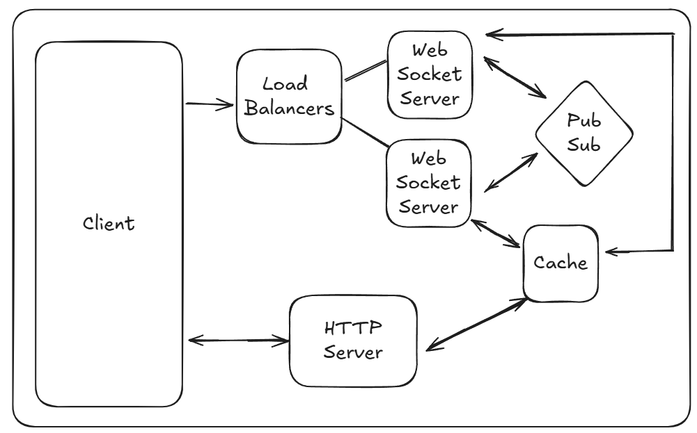

# SketchGuess

A distributed real-time multiplayer Pictionary game built with Next.js, WebSocket, and Express.

## Architecture Overview

## Features

- **Real-time multiplayer drawing and guessing**
- **Room creation and management**
- **Live chat functionality**
- **Distributed WebSocket architecture with non-sticky sessions**
- **Score tracking and game state management**
- **Load balanced WebSocket connections**
- **Responsive drawing canvas using react-konva**
- **Redis-powered state management and cross-server communication**

## State Management and Communication

### Redis Cache

Maintains shared state across all servers including:

- Room information and current game states
- User sessions and scores
- Active drawings and chat history
- Current drawer and word information

### Redis Pub/Sub

Enables real-time communication between WebSocket servers:

- Drawing updates
- Chat messages
- Game state changes
- Score updates

### HTTP Servers

Used to get game and room status while joining the room:

- Fetches room details and active players
- Retrieves current game state and score data
- Ensures a seamless transition when connecting to a room

### Non-sticky Sessions

- Users in the same room can connect to different WebSocket servers
- Load balancer distributes connections without session affinity
- All state is maintained in Redis, making WebSocket servers stateless
- Seamless failover and scaling capabilities

## Tech Stack

### Frontend

- Next.js
- TypeScript
- react-konva

### Backend

- Express.js
- WebSocket (ws)

### State Management

- Redis for caching and pub/sub

### Infrastructure

- Docker
- HAProxy

## Demo Video

